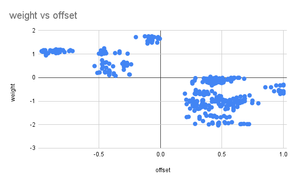

# Using Evolved Receptive Fields to Win the DodgeDrone Challenge
## Introduction

During ICRA2022, the Robotics and Perception Group at University of Zurich organized the DodgeDrone Challenge [^1] to benchmark progress in the research area of agile flight and obstacle avoidance. Teams had to develop the vision based AI for agile, autonomous drone flight in simulated, obstacle-ridden environments. In this paper we will describe our winning approach and analyze our findings. We show that by evolving receptive fields we can achieve remarkable results after just a few generations. We took inspiration from the hyperNEAT [^2] algorithm by Stanley et al. Although our winning solution only needed one gene in total, our interest is in the benefit of complexification by the NEAT [^3] algorithm. We present a preliminary analysis of our approach and also confirm the benefit of complexification. We conclude with directions for future research based on our findings.

## Background
In nature we find that evolution has led to many highly efficient vision systems by co-evolving sensors, body and brain. Even small animals with few light-sensitive cells can successfully perform agile flight (e.g. flies, which only have ~800 facets with 8 photosensitive cells = 6400 “pixels”).

In the case of the competition, we were provided with a depth image of 480 by 320 pixels at a rate of 25 Hz. The depth value was defined between 0 and 1 with 0 being close by and 1 being far off. The image was generated by a forward pointing camera mounted on a quadrotor in a simulated environment. The simulator used in this competition was Flightmare [^4]. The quadrotor was positioned at one end of a warehouse and the target of the challenge was to get to the other end, spanning 60 meters. Obstacles in the form of spheres with different sizes (some of which were moving) were distributed across this space. A screenshot of the scene can be found in figure 1. Three levels of difficulty (easy, medium, hard) were defined by using different densities of spheres. We refer to [^1] for more details.


*figure 1*

There were three different control modes for the quadrotor (in order of increasing level of abstraction): commanding individual single-rotor thrusts (SRT), specifying mass-normalized collective thrust and body rates (CTBR), and outputting linear velocity commands and yaw rate (LINVEL). Although [^5] shows that best performance is achieved with mass-normalized collective thrust and body rates, in our approach we use the highest level of abstraction (i.e. LINVEL) for simplicity.

For mapping the input image to output control actions, we were inspired by hyperNEAT [^2], which shows that there is value in using the coordinates of input and output nodes when evolving the weights of a neural network. This is done by evolving a separate (“hyper”) network to set the weights of the underlying neural network. Furthermore, by augmenting this hyper network through the NEAT [^3] algorithm, we gradually complexify the way the weights are set.

## Method
The first step we took was to reduce the depth image to a 16 x 16 pixel inverse depth image. Hence a value of 1 means close by (“danger”), while 0 means far off (“clear”). Next we introduced the concept of visual receptive fields. A receptive field “focuses” on a specific area of the depth image by giving more weight to pixels around the focal point. This can be defined as a Gaussian function. To apply this function, we first map each of the 256 pixels to coordinates in the domain [-1, 1], [-1, 1] (figure 2).


*figure 2*

We can now calculate the activation of a receptive field as follows:
```math
\begin{align}
&R(f) = w \sum_p D(p) e^{-\frac{\Delta(p,f)^2}{2\sigma^2}} \\
&p \in \{\text{all pixels}\} \\
&\sigma = \text{scale} \\
&f = \text{focal point} \\
&w = \text{weight} \\
&D(p) = \text{depth value of $p$} \\
&\Delta(p,f) = \text{distance between $p$ and $f$}
\end{align}
```
Intuitively, it makes sense that the activation of a receptive field with a focal point to the left of the image center, mostly impacts the decision of whether or not to move left. Similarly, we would at the same time expect corresponding receptive fields for the right, up, down and forward directions (corresponding to moving right, up, down and forward respectively). Hence we define a single encoding to represent a set of five receptive fields corresponding to the five directions. A single offset then defines the distance to the center for each of the four "directional" focal points (while the "forward" focal point always stays at the center). We allow for the agent to have multiple instances of this encoding (i.e. multiple sets of five receptive fields). We can then calculate an activation per direction as follows:
```math
\begin{align}
&A(d) = \sum_i R(f_{i,d}) \\
&d \in \{\text{up,right,down,left,forward}\} \\
&f_{i,d} = \text{focal point of $i$th encoding in direction $d$}
\end{align}
```
Finally, at each time step, we pick the direction with the highest activation and translate it to the corresponding control command using table 1.

| action | v_x | v_y | v_z | yaw |
| --- | ---: | ---: | ---: | ---: |
| up | 3.0 | 0.0 | 1.2 | 0.0 |
| right | 3.0 | 1.2 | 0.0 | 0.0 |
| down | 3.0 | 0.0 | -1.2 | 0.0 |
| left | 3.0 | -1.2 | 0.0 | 0.0 |
| fwd | 3.0 | 0.0 | 0.0 | 0.0 |

*table 1*

The target velocities are in world frame reference, as expected by the LINVEL control mode. Note that although the yaw rate is kept constant at 0, there is no guarantee that the pitch and roll are 0. The roll especially will change when moving left or right. This means that left on the depth image does not correspond perfectly to left in the world frame, but we decided to ignore this fact for now.

So far we have defined a way to use receptive fields to map a depth image input to one of five actions. We will now optimize the number of receptive fields and their parameters by using an evolutionary algorithm.

We already showed that with one encoding we can represent five receptive fields, i.e. one for each of the five directions. Let this encoding be the encoding of a single gene with three attributes: offset, weight and scale. We can evolve each gene using a standard evolutionary algorithm. Furthermore, we can add new genes (or delete existing ones) during evolution according to NEAT [^3], by setting a probability for adding or deleting a gene. In our representation this corresponds to adding (or deleting) sets of receptive fields in that agent. At the start of an evolutionary run, we can set the initial number of genes.

Finally, we can determine the fitness of each agent by running a single trial in the simulator, and measuring the distance traveled before hitting an obstacle (with a maximum of 60 meters).

## Experiments
For training, we decided to run the evolution in the provided environment levels with difficulty hard. Out of 100 of such levels we selected the first 20. Each generation of the evolution we sample (without replacement) one of these 20 levels and run a single trial for every agent to determine its fitness. We do this for 20 generations and as such use all 20 levels. By using a different level for each generation we remove the risk of overfitting. The downside is that we noticed that even though all levels are of the same difficulty class, some levels happen to be easier for the task at hand than others. This introduces a lot of noise when comparing fitnesses across generations. To reduce this noise, (and remove the effect of the order of levels on the evolutionary process,) we run 20 separate evolutions, shuffling the order of the levels in each case. The exact setting of the evolutions can be found in table 2.

| attr | dist | mut rate | mut power | min | max |
| --- | --- | ---: | ---: | ---: | ---: |
| offset | uniform | 0.5 | 0.05 | 0.0 | 1.0 |
| weight | normal | 0.5 | 0.05 | -30.0 | 30.0 |
| scale | normal | 0.5 | 0.05 | -30.0 | 30.0 |

*table 2*

We are especially interested in the effect of complexification on the evolutionary process. Complexification in our case is the ability to add new genes to the genome, resulting in more (sets of) receptive fields. To analyze this effect we run three experiments with different settings, as shown in table 3. Across experiments we make sure the order of the levels used for training is synchronized to allow for a fair comparison with paired samples.

|  | add gene % | del gene % | init gene # |
| --- | ---: | ---: | ---: |
| *experiment 1* | 10% | 1% | 1 |
| *experiment 2* | 0% | 0% | 1 |
| *experiment 3* | 0% | 0% | 2 |

*table 3*

## Results
The results of our experiments can be found in figure 3. First of all, we were surprised by the remarkable performance of the receptive field encoding. Even without complexification and only one gene (experiment 2), the agents develop very efficient obstacle avoidance behavior. It is worth noting here that the agent that won the competition at ICRA2022 was evolved in only four generations and used only one gene! The strength of a good indirect encoding for the receptive fields is clearly the determinant factor in the success of our approach and winning the competition.


*figure 3*

Still we see that, at least on average, the complexification shows a better performance than using one single gene only. Indeed, a paired samples t-test shows that after 20 generations experiment 1 significantly outperforms experiment 2 when looking at the average fitness of the populations. When comparing experiment 1 with experiment 3 there is no significant difference in performance.

To analyze these results further, we looked at the distribution of two of the attributes of the genes: offset and weight. Intuitively, we would expect a positive offset (i.e. receptive field connected to the output in the same direction) to coincide with a negative weight (_if we see an obstacle in that direction, do not go there_). Similarly, a negative offset would coincide with a positive weight. The data from our experiments confirm this relation as shown in figure 4. There is a subtle difference in both cases though. A positive offset (and negative weight) holds a bit more accurate information: _if there is an obstacle in one direction, do not go there_ (just go *any* other direction instead). A negative offset (and positive weight) is more limiting (in a bad way): _if there is an obstacle in one direction, go opposite of it_ (ignoring the other options). Because of this, we hypothesize that evolved agents with only one gene and a negative offset, underperform compared to evolved agents with only one gene and a positive offset. Our data confirms this hypothesis as shown in figure 5.



*figure 4*


*figure 5*

We conclude that experiment 2 underperforms compared to experiment 1 and 3 because it is limited to one gene only. Hence, in some evolutions it gets stuck with a negative offset: in the first few generations, the negative offsets happen to outperform the positive offsets by chance, and these genes will then dominate the evolution. Consequently, the evolution converges to a suboptimal solution. We were able to confirm this by rerunning experiment 2, but this time limiting the offset attribute to positive values only. The results indeed confirm that in this case there is no significant difference in performance between experiment 1, 2b and 3 as shown in figure 3.

## Conclusion
We introduced an indirect genetic encoding for receptive fields that proved surprisingly efficient in the task of obstacle avoidance. Although the performance does not necessarily increase by adding more genes (i.e. complexifying), it turns out the ability to complexify does increase the robustness of the evolutionary process.

Our method seemed to reach the upper bound of its fitness very quickly, which could also be due to the high level of abstraction of the output space (i.e. the LINVEL flight controller). In future research we would like to investigate and improve our method with different controllers. Also, we would like to further test the robustness of our method by crossing the reality gap and running our solution in the real world. Lastly, our research interest continues to focus on the benefits of complexification. Future work will look into new tasks and environments that we believe require complexification to succeed with an evolutionary process.

## Acknowledgements
This work was part of a collaboration with [guidoAI](https://github.com/guidoAI) and [NPU-yuhang](https://github.com/NPU-yuhang), and the [MAVLab](https://github.com/tudelft) organization. Many thanks to them for the fruitful discussions!

[^1]: [ICRA 2022 DodgeDrone Challenge: Vision-based Agile Drone Flight](https://uzh-rpg.github.io/icra2022-dodgedrone/)
[^2]: Stanley, Kenneth O., David B. D'Ambrosio, and Jason Gauci. "A hypercube-based encoding for evolving large-scale neural networks." *Artificial life* 15.2 (2009): 185-212.
[^3]: Stanley, Kenneth O., and Risto Miikkulainen. "Efficient reinforcement learning through evolving neural network topologies." *Proceedings of the 4th Annual Conference on genetic and evolutionary computation.* 2002.
[^4]: Song, Yunlong, et al. "Flightmare: A flexible quadrotor simulator." *Conference on Robot Learning.* PMLR, 2021.
[^5]: Kaufmann, Elia, Leonard Bauersfeld, and Davide Scaramuzza. "A benchmark comparison of learned control policies for agile quadrotor flight." *arXiv preprint arXiv:2202.10796* (2022).

